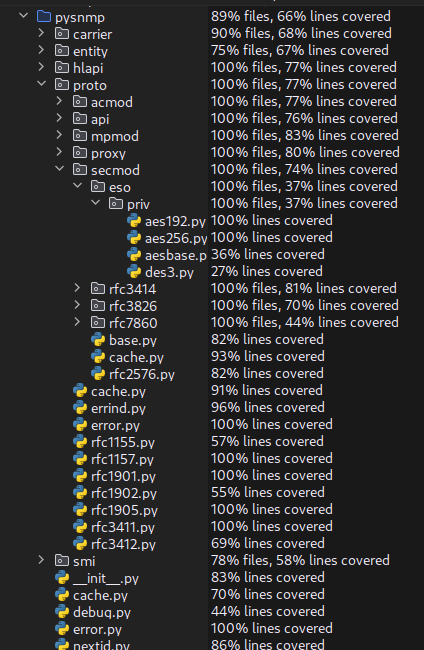
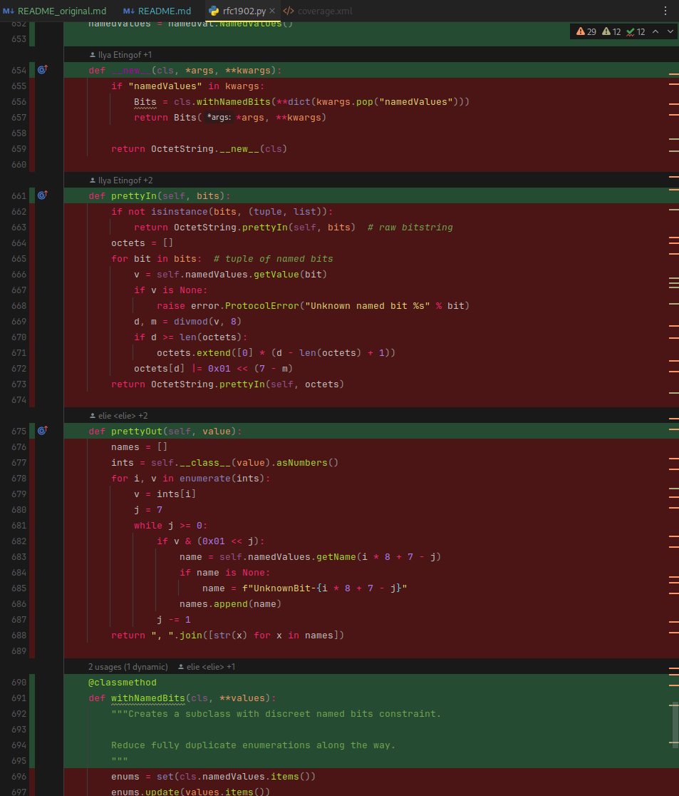
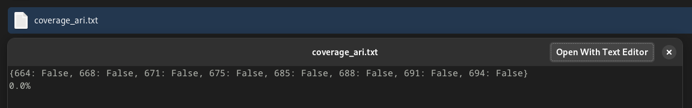
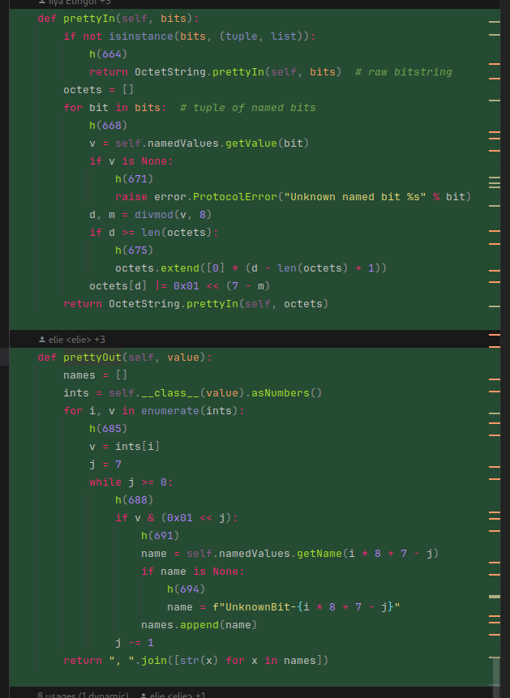
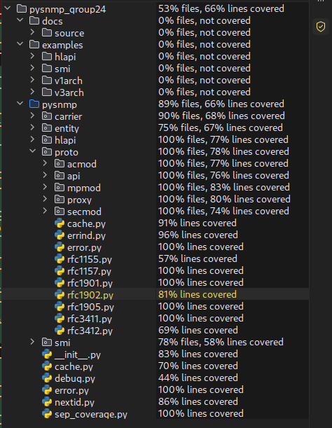
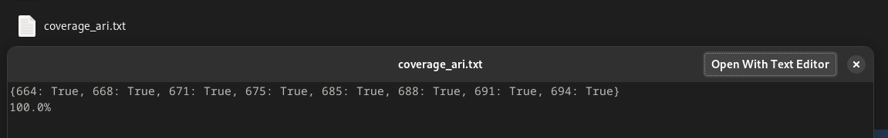

# Report for Assignment 1

## Project chosen

Name: pysnmp

URL: https://github.com/lextudio/pysnmp

Number of lines of code and the tool used to count it: 24961 (`lizard pysnmp`)

Programming language: Python

## Coverage measurement

### Existing tool

`coverage.py` + `pytest-cov` was used for coverage

```bash
poetry run pytest --cov=pysnmp --cov-report=xml:coverage.xml
```

#### Overview


#### Functions - Ari Ionescu




### Your own coverage tool

[//]: # (<The following is supposed to be repeated for each group member>)

Ari Ionescu

`Bits.prettyIn()`: [pysnmp/proto/rfc1902.py](pysnmp/proto/rfc1902.py)

`Bits.prettyOut()`: [pysnmp/proto/rfc1902.py](pysnmp/proto/rfc1902.py)

Link to commit: 43798f4e



IDs represent lines where the instrumentation was added.

IDs 664 - 675: `Bits.prettyIn()`
IDs 685 - 694: `Bits.prettyOut()`

## Coverage improvement

### Individual tests

[//]: # (<The following is supposed to be repeated for each group member>)

Ari Ionescu

#### Test 1

Both sets of tests are in commit 293cd1aa.

##### Before

`coverage.py`:


Own tool:


##### After

`coverage.py`:




Own tool:



Coverage improvement was from 0% to 100% branch coverage for both functions, as the different tests exercies all 
tested cases.


### Overall

<Provide a screenshot of the old coverage results by running an existing tool (the same as you already showed above)>

<Provide a screenshot of the new coverage results by running the existing tool using all test modifications made by the group>

## Statement of individual contributions

<Write what each group member did>
